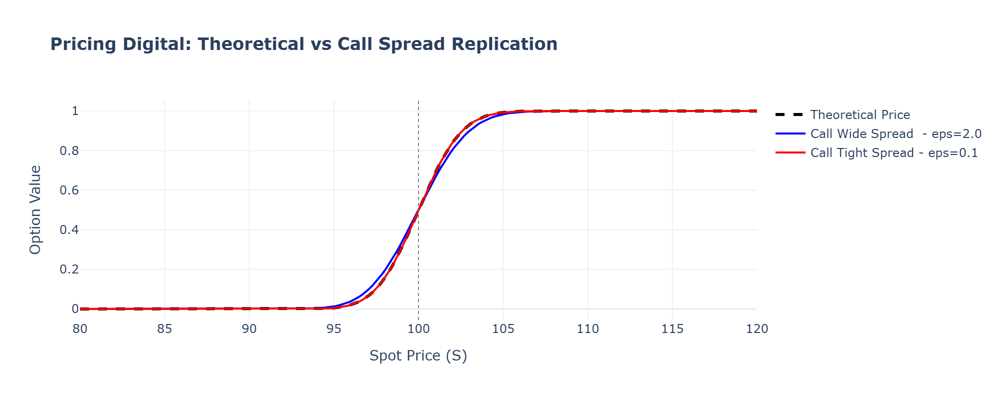
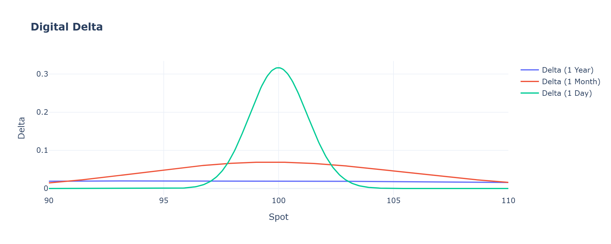
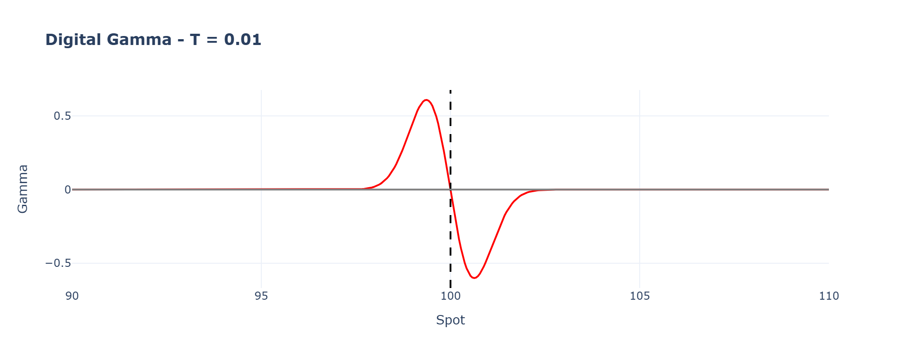
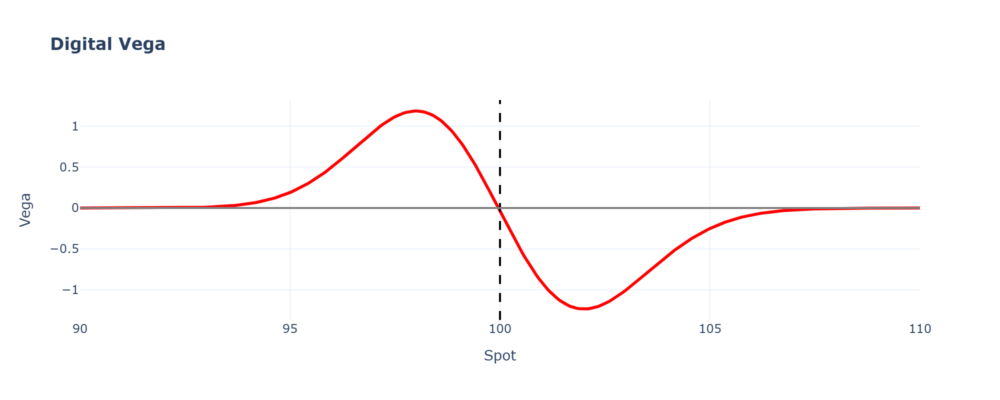
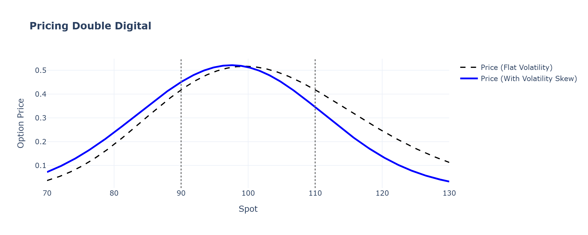

# Exotic Options: Pricing & Risk Management of Discontinuous Payoffs

This repository explores the pricing and risk management of first-generation exotic options, focusing specifically on **Digital (Cash-or-Nothing)** and **Double Digital (Range Binary)** options. 

Inspired by standard trading desk practices, this project goes beyond theoretical Black-Scholes pricing to address the practical challenges of hedging discontinuous payoffs, such as infinite Greeks, pinning risk, and volatility skew impacts.

## Key Features & Analysis

### 1. Pricing & Static Replication
A digital option payoff is a mathematical step function, which is impossible to hedge perfectly in reality. The pricing engine implements both:
* **Theoretical Pricing:** Closed-form Black-Scholes solutions.
* **Static Replication:** Approximating the digital payoff using a tight **Bull Call Spread**. The project visualizes how the spread width ($\epsilon$, the overhedge) impacts the theoretical price and smooths the discontinuity.


As $\epsilon$ narrows, the call spread price converges strictly to the theoretical digital value. In practice, this highlights the direct trade-off between minimizing tracking error and the execution costs associated with a tighter spread.

### 2. Greek Dynamics & "Shadow Risk"
As time to maturity ($T$) approaches zero, the risk parameters of digital options become highly unstable. This project provides visualizations of:

* **The Delta:** Observing the Delta spike into a Dirac distribution near maturity.


* **Shadow Gamma:** Analyzing the violent positive-to-negative Gamma transition around the strike, demonstrating the severe "pinning risk" faced by hedgers.

The violent sign change in Gamma around the strike forces market makers to abruptly flip their hedge direction which expose the book to massive gap risks if the spot pins near the strike at expiry.

* **Directional Vega:** Highlighting the "Vega flip" (Long Volatility when Out-of-The-Money, Short Volatility when In-The-Money).

Unlike vanilla options, Digital Vega exhibits a strict sign flip: long volatility when OTM and short volatility when ITM.

### 3. Double Digital & Volatility Smile
Pricing a Range Binary option (Double Digital) using a flat volatility assumption leads to severe mispricing. 
* We implement a dual-volatility engine to inject realistic **Volatility Skew** (e.g., higher implied volatility on the downside). 
* The project maps out how the volatility smile reshapes the option's value and heavily distorts the Greeks across the lower and upper boundaries.


Injecting volatility skew asymmetrically distorts the pricing and shifts the optimal hedge ratios at the barriers, proving that flat-vol assumptions systematically misprice range-bound exotics.

## Project Structure

```text
Exotic_option_pricing/
│
├── exotics/                  # Core pricing and risk library
│   ├── engine.py             # ExoticOptions class (BS & Call Spread Replication)
│   ├── greeks.py             # Analytical Greeks for Digital & Double Digital
│   └── utils.py              # Vanilla BS tools
│
├── notebooks/                
│   ├── 1_digital_pricing.ipynb
│   ├── 2_greek_dynamics.ipynb
│   └── 3_double_digital_smile.ipynb
│
└── images/                   